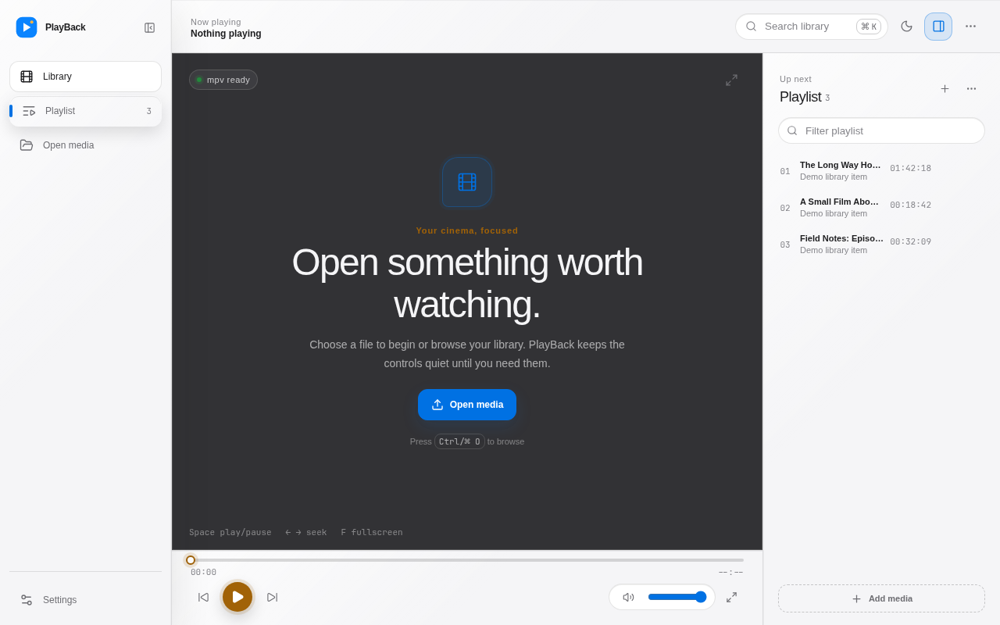

# PlayBack

<p align="center">
  
</p>

[](https://github.com/useless-rs/PlayBack/actions/workflows/ci.yml)
[](https://crates.io/crates/playback-player)
[](LICENSE)

PlayBack is a keyboard-first desktop media player with a calm macOS-inspired liquid-glass shell, a focused playback surface, and the flexibility of mpv without being buried in configuration.

The project is being reorganized around **Tauri v2 + React + TypeScript + Vite**, while preserving the existing Rust playback, configuration, and CLI crates. The visual language is original: it borrows interaction ideas from modern media players and macOS conventions, but it does not copy IINA assets, branding, source, or trade dress.

> **Current architecture:** the Tauri window owns the library, playlist, settings, keyboard model, and playback controls. The Rust backend manages an `mpv` process and communicates through typed Tauri commands and events. The first release keeps mpv's native output window as the video surface; the renderer boundary is isolated so a future embedded surface can replace it without rewriting the product model.

## What is here

- **Library-first playback** — open local media, keep a lightweight queue, and return to the last useful context quickly.
- **Keyboard-first UX** — Space, arrow keys, `F`, `Ctrl/⌘K`, and `Ctrl/⌘O` are first-class actions, not hidden power-user features.
- **Tauri v2 backend** — typed commands, events, capabilities, window-state persistence, native dialogs, OS information, and opener support.
- **Rust core** — mpv-compatible parsing, process backend, shared playback state, Lua configuration, and CLI support remain reusable crates.
- **Cross-platform foundation** — the frontend and Tauri shell target macOS, Windows, and Linux; the CLI remains usable in headless environments.
- **Reduced-motion and accessibility basics** — visible focus, semantic buttons, keyboard seek controls, screen-reader labels, responsive desktop layouts, and `prefers-reduced-motion` support.

## Brand

- **Logo:** [`logo.svg`](./logo.svg) for the full horizontal mark; [`assets/logos/icon-only/logo-icon.svg`](./assets/logos/icon-only/logo-icon.svg) for favicons and app icons.
- **Palette:** system blue `#0a84ff` for actions, amber `#ffb340` for playback state, graphite `#0b0b0d` for the stage, and Apple gray `#f5f5f7` for light surfaces.
- **Voice:** calm, precise, and quietly confident. Say what the player does; do not sound like a dashboard or a marketing machine.
- **Material:** liquid glass is reserved for navigation and controls; the media stage stays solid and readable.
- **Rules:** keep clear space around the mark, use the approved variants, and never stretch, rotate, gradient-fill, or shadow the logo.

See [`DESIGN.md`](DESIGN.md) and the approved assets under [`assets/logos/`](assets/logos/) for the full identity and usage rules.

## Get the desktop app

The desktop UI is the Tauri application. It is delivered as a platform bundle in GitHub Releases, not as the crates.io CLI package:

- **Linux:** download the `.deb` or `.rpm` asset from the latest `desktop-v*` release.
- **macOS:** download the `.dmg` asset.
- **Windows:** download the `.msi` or `.exe` asset.

The `playback-player` crate installs the `playback` command-line tool only; it does not install this graphical window.

## Screenshots

<p align="center">
  
</p>

The desktop shell is designed around a quiet media surface, compact toolbar, keyboard-first transport, playlist rail, and native-feeling settings sheet.

## Install the CLI

The installable command is `playback`. The crates.io package is named `playback-player` because `playback` is already registered by another project.

```bash
cargo install playback-player --locked
playback --help
```

You can also install the current repository directly:

```bash
cargo install --git https://github.com/useless-rs/PlayBack --locked
```

PlayBack uses the system `mpv` executable for playback, so install mpv through your operating system first when it is not already available.

## Quick start

### Requirements

- Rust `1.85+`
- Node.js `22+`
- `mpv` available on `PATH`
- Tauri v2 platform prerequisites:
  - macOS: Xcode Command Line Tools
  - Windows: Microsoft C++ Build Tools and WebView2
  - Linux: WebKitGTK, AppIndicator, librsvg, and patchelf packages

### Run the desktop app

```bash
npm install
npm run desktop:dev
```

The Tauri configuration lives in [`src-tauri/tauri.conf.json`](src-tauri/tauri.conf.json). During development, Vite serves the frontend at `http://localhost:5173` and Tauri loads it in the native window.

### Run the CLI

The original Rust CLI remains available for scripting and headless environments:

```bash
cargo run -p playback-player -- video.mp4 --volume=80
cargo run -p playback-player -- --help
```

The CLI accepts both `--option=value` and `--option value`, plus mpv-compatible legacy single-dash forms. It forwards unknown options to mpv instead of silently dropping them.

## Project layout

```text
playback/
├── frontend/                    # React + TypeScript + Vite desktop frontend
│   ├── src/components/          # Sidebar, stage, transport, playlist, settings
│   ├── src/lib/ipc.ts            # Typed Tauri command/event boundary
│   └── src/styles.css            # Cross-platform visual tokens and layout
├── src-tauri/                   # Tauri v2 Rust application
│   ├── capabilities/             # Least-privilege window capabilities
│   ├── src/playback.rs           # Managed mpv process and typed commands
│   ├── src/lib.rs                # Tauri builder and plugin registration
│   └── tauri.conf.json           # v2 window, bundle, and security config
├── crates/
│   ├── playback-core/            # Parsing, state, mpv backends, invocations
│   ├── playback-config/          # Lua evaluation, schema, reload watcher
│   ├── playback-ui/              # Renderer-neutral UI models and legacy shell
│   └── playback-cli/             # CLI and shell completions
├── docs/README.md                # Detailed architecture and migration notes
└── Cargo.toml                    # Published Rust workspace
```

## UX direction

The interface is designed around four principles:

1. **The content leads.** Chrome stays quiet, the transport is close, and the playlist is always one action away.
2. **The keyboard is a first-class input.** Shortcuts are visible in context and every pointer action has a keyboard equivalent.
3. **State should never surprise you.** The active item, playback position, volume, and queue state are always easy to locate.
4. **Motion explains change.** Transitions are short, purposeful, and disabled when the system requests reduced motion.

The visual system uses a neutral graphite base, system-blue actions, a single amber playback signal, system-first typography, restrained liquid-glass chrome, and compact controls. It is intentionally not a clone of any existing player.

## Tauri commands and events

The frontend talks to Rust through `@tauri-apps/api` v2 wrappers in [`frontend/src/lib/ipc.ts`](frontend/src/lib/ipc.ts). The backend currently exposes:

- `get_playback_snapshot`
- `get_app_config`
- `save_app_config`
- `open_media`
- `toggle_playback`
- `seek_relative`
- `seek_absolute`
- `set_volume`
- `toggle_fullscreen`
- `next_track`
- `previous_track`
- `shutdown_session`

The backend emits `playback://state` after state-changing commands. New capabilities must be added to [`src-tauri/capabilities/default.json`](src-tauri/capabilities/default.json); do not grant broad filesystem or shell access by default.

## Development

Install frontend dependencies once:

```bash
npm ci
```

Useful checks:

```bash
# Rust workspace
cargo fmt --all -- --check
cargo clippy --workspace --all-targets --all-features -- -D warnings
cargo test --workspace --all-features
cargo build --release --workspace

# Tauri backend
cargo check --manifest-path src-tauri/Cargo.toml
cargo clippy --manifest-path src-tauri/Cargo.toml --all-targets -- -D warnings

# Frontend
npm run build
npm run desktop:info
```

CI runs the Rust workspace, frontend build, and Tauri backend check on Ubuntu, macOS, and Windows.

## Build desktop bundles

The normal Tauri build embeds `frontend/dist`, so the desktop artifact contains the same UI verified in the browser preview. On Linux, use the explicit package script to avoid the optional AppImage/FUSE bundler:

```bash
# Linux (.deb and .rpm)
npm run desktop:package

# macOS (.dmg)
npm run desktop:build -- --bundles dmg

# Windows (.msi and NSIS installer)
npm run desktop:build -- --bundles msi,nsis
```

For a macOS universal build, install both Rust targets first:

```bash
rustup target add aarch64-apple-darwin x86_64-apple-darwin
npm run desktop:build -- --target universal-apple-darwin
```

## Publishing the Rust workspace

The Tauri desktop application is released as a desktop bundle. The reusable Rust workspace is published to crates.io in dependency order:

```bash
cargo publish -p playback-core
cargo publish -p playback-config
cargo publish -p playback-ui
cargo publish -p playback-cli
cargo publish -p playback-player
```

The GitHub Actions publish workflow performs the same order with Trusted Publishing. Do not publish dependent crates before their internal dependencies exist on crates.io. The root package publishes as `playback-player` and installs a binary named `playback`.

## Migration notes

The original project used a macOS-only GPUI shell. The migration keeps the Rust domain crates and replaces the application shell with Tauri v2:

- `playback-core` remains the source of truth for mpv-style arguments, playback state, and backend operations.
- `playback-config` remains the source of truth for Lua configuration and live reload behavior.
- `playback-cli` remains available for automation and headless playback.
- `playback-ui` remains as a renderer-neutral model crate while the React frontend becomes the primary desktop UI.
- The managed Tauri backend starts `mpv` as a child process and communicates through typed commands/events.
- The macOS window uses an overlay titlebar, hidden title, traffic-light positioning, and an opaque app-canvas background; custom window controls keep the frameless shell usable without exposing desktop content through the player.
- Linux and Windows use the same React surface and Tauri command boundary, with platform behavior delegated to the webview and operating system.

## Lucide icon inventory

The React UI uses Lucide icons only. Structural icons have accessible labels through the shared `IconButton` component.

| Area | Icons |
| --- | --- |
| Navigation | `Film`, `ListVideo`, `FolderOpen`, `Settings2`, `PanelLeftClose`, `PanelLeftOpen`, `HardDrive` |
| Window and actions | `Search`, `Command`, `Moon`, `Sun`, `PanelRight`, `MoreHorizontal`, `Plus`, `X`, `Minus`, `Maximize2` |
| Playback | `Play`, `Pause`, `RotateCcw`, `RotateCw`, `SkipBack`, `SkipForward`, `Volume2`, `VolumeX`, `Gauge`, `Captions`, `Maximize2` |
| Playlist and settings | `Check`, `Trash2`, `SlidersHorizontal`, `MonitorPlay`, `Subtitles`, `Palette`, `Keyboard`, `Cpu`, `AlertTriangle`, `RefreshCw` |

## License

PlayBack is dual-licensed under either the [MIT License](LICENSE-MIT) or the [Apache License, Version 2.0](LICENSE-APACHE). See [`LICENSE`](LICENSE) for the project notice.
